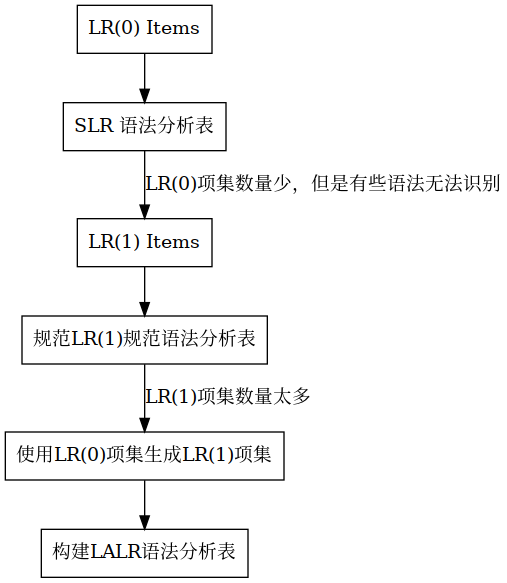
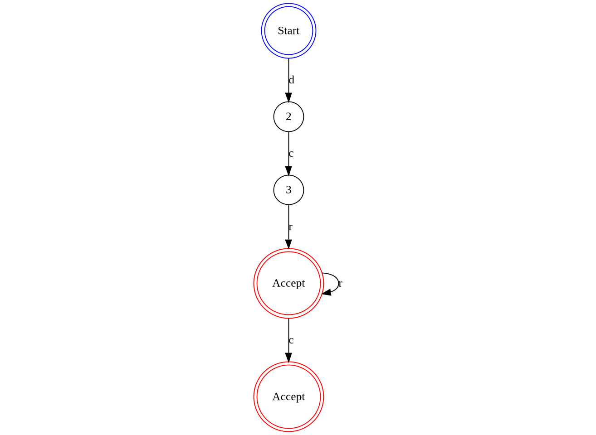
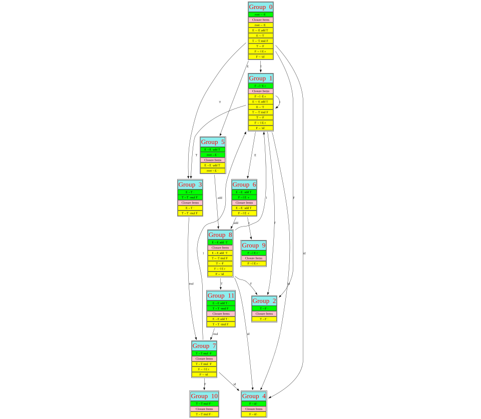
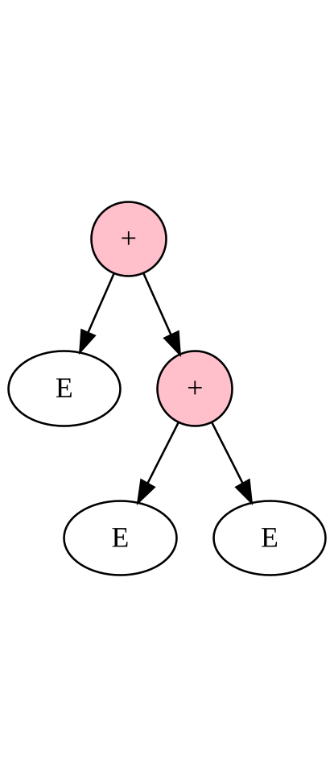
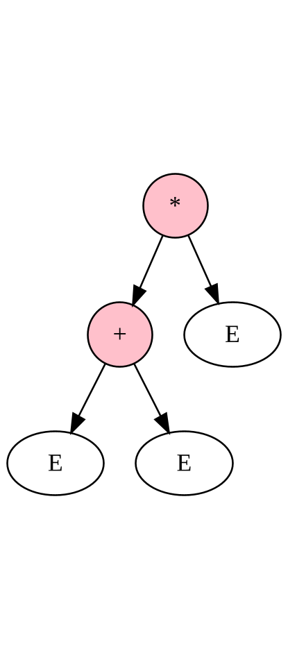

# Dive in compilers
本项目的主要目的是从零开始实现一个小型的编译器，并尽可能将其中所涉及到的重要内容可视化.

下一步要支持的主要功能是实现语法分析流程可视化，从而使自底而上的语法分析过程更加直观

## 《编译原理》里的语法分析这一章究竟在讲什么？

因为LALR语法分析表可以在原来LR0项集的基础上生成LR1项集，这样一来就能同时达到减少项集的数量并且能够识别更多的文法
所以几乎所有的语法分析器都使用了LALR来构造语法分析表.

但是不幸的是在《编译原理》这本书中所举的例子太过于抽象，很难理解

# CFLex示例

# CBison示例
CBsion是我基于《编译原理》开发的语法分析器生成器。
CBsion的最初想法是为了模仿Yacc架构。与Yacc不同的是，CBison的重点并不侧重于构建一个高可用的语法分析器生成器，而是将主要的工作集中在原理的可视化上。

CBison希望能够做到通过作图的方式理解复杂的编译原理。

## 左结合、右结合与优先级的真正含义

这三个词实际上决定了当语法分析器究竟是选择规约动作还是选择移入动作。

这里举例说明，

**左结合与右结合的区别**

假设语法分析器出于以下这种状态

| 前缀 |    栈    | 输入 |
| :--: | :------: | :--: |
| E+E  | X1,X2,X3 |  +E  |

那么对于左结合与右结合会发生以下的不同情况

|         左结合          |          右结合          |
| :---------------------: | :----------------------: |
|     先规约，再移入      |      先移入，再规约      |
|  |  |

 

**优先级的意义**

无论是左结合还是右结合都要先进行优先级高的运算

+ 目前我还是认为优先级的作用更大，毕竟这个二义性文法主要是来解决究竟是选择规约还是选择移入的问题

假设语法分析器出于以下这种状态

| 前缀  |    栈    | 输入 |
| :--: | :------: | :--: |
| E+E  | X1,X2,X3 |  *E  |

那么对于左结合与右结合会发生以下的不同情况

|      *的优先级比+低      |       *的优先级比+高       |
| :----------------------: | :------------------------: |
|      先规约，再移入      |       先移入，再规约       |
|  |  |

 

